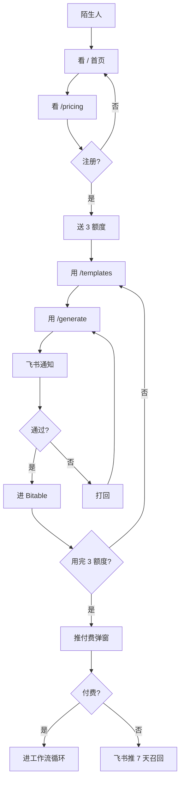
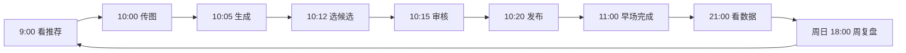

# Task 05 — 业务流程（3 类）

**状态**：🟡 pending
**估时**：2 天
**是否要 Codex**：❌ 我（Hermes）独立完成
**依赖**：无
**最后更新**：2026-06-17 01:18

---

## 目标

把客户、店主、运营每天会碰到的所有流程**画清楚、写清楚**。让任何新员工 / 客户 / 顾家经销商 30 分钟看懂"我该怎么用"。

---

## 流程 A：客户全旅程

```
陌生人 → 看 / 首页
        → 看 /pricing
        → 注册（飞书 OAuth, 来自 #1 鉴权）
        → 试用（送 3 个视频额度）
        → 用 /templates 选模板
        → 用 /generate 出第 1 个视频
        → 看 /asset 视频库
        → 飞书收到"待审核"卡片
        → 点"通过", 进 Bitable
        → 用完 3 个额度, 弹付费弹窗
        → 选 ¥3000/月基础版
        → 付完进工作流循环
        → 30 天后看 /dashboard 复盘
        → 续费 / 流失
```

**关键节点**：
- **T+0** 注册 → 自动送 3 额度
- **T+1** 出第 1 视频 → 飞书通知店主（不是客户）
- **T+7** 用完 3 额度 → 推付费弹窗 + 飞书通知店主"该付费了"
- **T+30** 续费决策 → 飞书推复盘数据 → 店主决策
- **T+60** 流失风险 → 飞书推 7 天召回文案

**画法建议**（plain text Mermaid）：


---

## 流程 B：店主每日 SOP

```
[早 9:00]  收到飞书通知: "今日推荐选题"
           看 /templates 选 1 个
[10:00]    上传昨晚拍的产品图 (3-5 张) 到 /asset
[10:05]    在 /generate 选模板 + 选模型 (默认自动) + 点生成
[10:10]    /generate 轮询等结果 (60-90 秒)
[10:12]    看 3 个候选视频, 选 1 个
[10:15]    飞书收到"待审核" → 点"通过"
[10:20]    一键发布到抖音草稿 (P1 推, 早期手动复制)
[11:00]    飞书收到"早场任务完成"

[晚 21:00] 飞书收到"今日数据" (曝光/留资/转化)
           看 /asset 自己的视频 + 数据

[周日 18:00] 飞书收到"本周复盘"
            看 /dashboard
            飞书自动生成"下周建议" (3 条)
```

**画法**：


**异常处理**（**最容易漏**）：
- 9:00 没看飞书 → 飞书 9:30 重推 + 10:00 重推 + 短信兜底
- 10:05 生成失败 → 自动 retry 2 次 → 仍失败推飞书人工
- 10:15 审核超时 → 飞书催办 + 升到店长
- 10:20 发布失败 → 飞书通知 + 视频留草稿不丢
- 21:00 数据没回 → 飞书推"数据延迟, 明天再看"

---

## 流程 C：异常流（5 条必做）

| # | 异常 | 触发 | 自动动作 | 升级路径 |
|---|---|---|---|---|
| 1 | **生成失败** | 模型 API 报错 | 自动 retry 2 次（30s 间隔） | 仍失败 → 飞书推店主"换模型" + 退额度 |
| 2 | **模型超时** | 90s 没返回 | 切备用模型（火山 ↔ 可灵） | 仍超时 → 飞书推店主"等 5 分钟" |
| 3 | **付费未到账** | 7 天宽限期到期 | 降级到试用版（功能阉割） | 飞书推店主"3 天后停服" |
| 4 | **用户流失** | 7/30/60 天未登录 | 飞书推召回文案（个性化） | 90 天后 → 自动归档 |
| 5 | **店主离职** | 30 天无活跃 | 飞书推店铺管理员 | 90 天无活跃 → 自动转让 |

**召回文案模板**（流失用）：
```
[7 天] "我们发现你 7 天没来了，刚给你做了 3 个新模板，看看？"
[30 天] "30 天没见，你走之前最爱的 [模板名] 又升级了"
[60 天] "60 天了，你的 [N] 个视频还在库房里，要不要回来看看？"
```

---

## 子任务

### ST-5.1 画 3 个流程图（0.5 天）

- [ ] 流程 A：客户全旅程（Mermaid 格式）
- [ ] 流程 B：店主每日 SOP
- [ ] 流程 C：异常流（5 条）

**输出**：`docs/flows/` 3 个 .md 文件 + 1 张 PNG（Mermaid 转图）

### ST-5.2 写 3 个 SOP 文档（1 天）

- [ ] 店主 SOP：每天 1 视频（给店主看 + 给顾家 10 经销商看）
- [ ] 运营 SOP：周复盘（给运营看）
- [ ] 获客 SOP：抖音视频引流 → 落地页 → 留资 → 1v1 销售（给销售看）

**输出**：`docs/sops/` 3 个 .md 文件

### ST-5.3 异常处理脚本（0.5 天）

- [ ] 5 条异常流的检测逻辑（用 cron 跑）
- [ ] 召回文案模板（3 套：7/30/60 天）
- [ ] 飞书通知触发

**实现**：`scripts/exception-handler.py` + crontab

---

## 给 Codex 的任务单

**不需要**。这 3 个流程我（Hermes）能画 + 写。

如果要 Codex 帮忙做的是：
- 把 3 个流程图转成**漂亮的网页展示** → 这是 task 04 的活
- 把 SOP 转成**可交互的检查清单** → 也是 task 04

---

## 完成标准（DoD）

- [ ] 3 个流程图画完（Mermaid + PNG）
- [ ] 3 个 SOP 文档写完
- [ ] 5 条异常流脚本能跑（dry-run 测试）
- [ ] 召回文案 3 套备好
- [ ] 拿给 1 个非项目人员（你的运营/店长）看 → 30 分钟能上手

---

## 风险

| 风险 | 概率 | 应对 |
|---|---|---|
| 流程图太复杂，店主看不懂 | 中 | 用大白话，别用专业术语 |
| SOP 文档没人看 | 高 | 强制首次登录看 1 分钟视频教程 |
| 异常流脚本不跑 | 中 | crontab + 监控告警 |
| 召回文案不个性化 | 中 | 早期 3 套通用文案，1.0 后个性化 |
